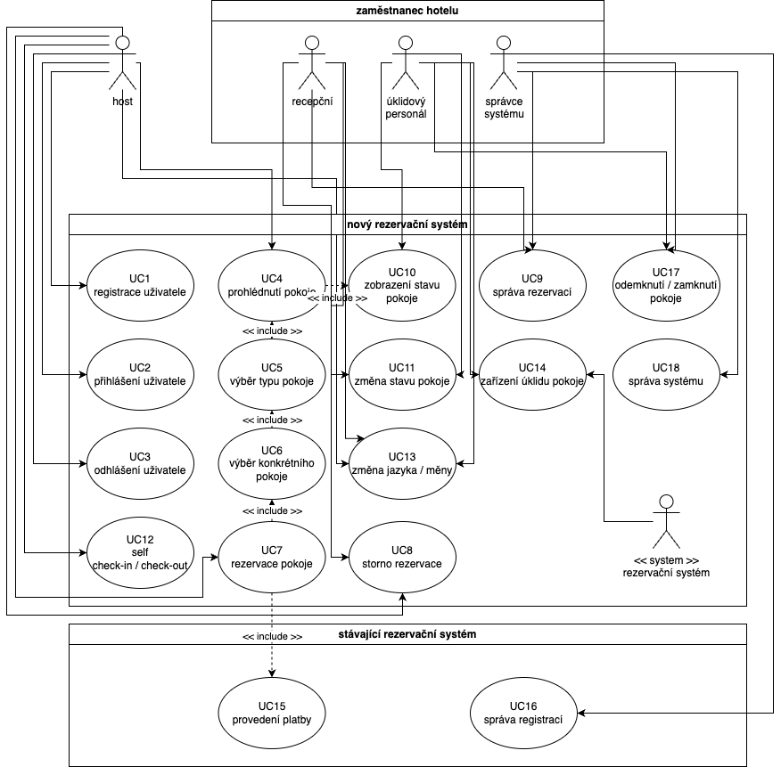

# [<-](../../../README.md "Zpět na přehled systému") Dokumentace monolitické vícevrstvé architektury

## Popis architektury a Systémový přehled

### Jednotná Integrace Funkcí

Tento rezervační systém hotelu je vyvíjen jako jednotný, integrovaný softwarový produkt. Klíčové funkce, jako registrace, rezervace, správa pokoje a kontrola úklidu, jsou implementovány do jedné společné aplikace. Tento přístup umožňuje bezproblémovou integraci různých modulů systému.

### Webová Technologie a Serverová Implementace

Aplikace je navržena s použitím moderních webových technologií, včetně HTML, CSS a JavaScriptu. Na serverové straně je využit Node.js, což poskytuje robustní a efektivní prostředí pro správu serverových procesů.

### Centralizovaná Databáze

Veškeré informace, včetně detailů o pokojích, rezervacích a stavu úklidu, jsou ukládány v centralizované databázi MySQL. Toto uspořádání umožňuje efektivní správu dat a snadný přístup k potřebným informacím.

## Výhody

- Snadnější a rychlejší vývoj, což je klíčové s ohledem na blížící se hlavní sezónu.

- Jednodušší nasazení a údržba, jelikož vše je součástí jedné aplikace.

## Nevýhody

- Může být obtížnější škálovat, pokud počet uživatelů nebo požadavků rychle naroste.

- Větší riziko výpadku celého systému při chybě v jedné části aplikace.

## Functionalita systému

V tomto pohledu je zobrazena funkcionalita rezervačního systému hotelu.

## UML Diagram užití

### Vysvětlivky diagramu

- **Use case (případ užití)** - funkce systému - kroužek
- **Actor (aktér)** - osoba / systém, který komikuje s modelovaným systémem - postava
- **Ohraničení systému** - vymezení modelovaného systému - kontejner

## Funkcionality

- **UC1** - Registrace uživatele: Umožňuje hostům vytvořit si účet v systému.
- **UC2** - Přihlášení uživatele: Umožňuje již registrovaným uživatelům přihlásit se do systému.
- **UC3** - Odhlášení uživatele: Umožňuje uživatelům odhlásit se ze systému.
- **UC4** - Prohlédnutí pokoje: Hosté mohou prohlížet dostupné pokoje a jejich detaily.
- **UC5** - Výběr typu pokoje: Hosté si mohou vybrat typ pokoje, který chtějí rezervovat.
- **UC6** - Výběr konkrétního pokoje: Hosté si mohou vybrat a rezervovat konkrétní pokoj.
- **UC7** - Rezervace pokoje: Hosté mohou provést rezervaci vybraného pokoje.
- **UC8** - Storno rezervace: Umožňuje hostům stornovat již provedenou rezervaci.
- **UC9** - Správa rezervací: Zaměstnanci mohou spravovat rezervace, včetně jejich úprav a storna.
- **UC10** - Zobrazení stavu pokoje: Systém zobrazuje aktuální stav pokoje.
- **UC11** - Změna stavu pokoje: Zaměstnanci mohou měnit stav pokoje (např. z 'volný' na 'rezervovaný').
- **UC12** - Self check-in / check-out: Umožňuje hostům provést check-in nebo check-out bez asistence personálu.
- **UC13** - Změna jazyka / měny: Hosté mohou změnit jazyk a měnu zobrazení v systému.
- **UC14** - Zařízení úklidu pokoje: Systém umožňuje zaměstnancům spravovat procesy úklidu.
- **UC15** - Provedení platby: Integrace s existujícím rezervačním systémem pro zpracování plateb.
- **UC16** - Správa registrací: Umožňuje zaměstnancům spravovat registrace uživatelů.
- **UC17** - Odemknutí / zamknutí pokoje: Systém umožňuje zaměstnancům ovládat zámky pokojů.
- **UC18** - Správa systému: Administrátoři mohou spravovat a konfigurovat celý rezervační systém.

## Sovisející

- [Pohledy](./views/README.md)
  - [Diagram komponent](./views/components/README.md)
  - [Diagram nasazení](./views/deployment/README.md)
- [Hodnocení architektury](./evaluation/README.md)
