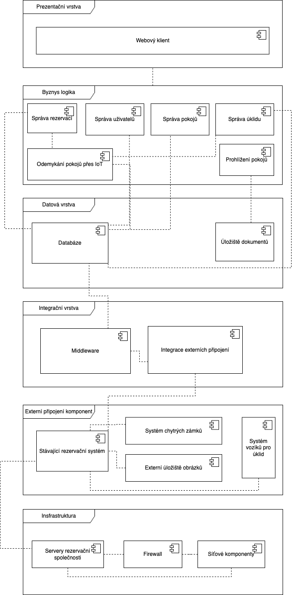

# Component View

V tomto pohledu jsou zobrazeny komponenty rezervačního systému hotelu dle architektury MMTA (Monolitic Multi-tier architecture).

//TODO: doplnit poznámky z wordu

## UML Diagram komponent

## Katalog komponent

//TOOD: popsat diagram

### název

popis

- část
