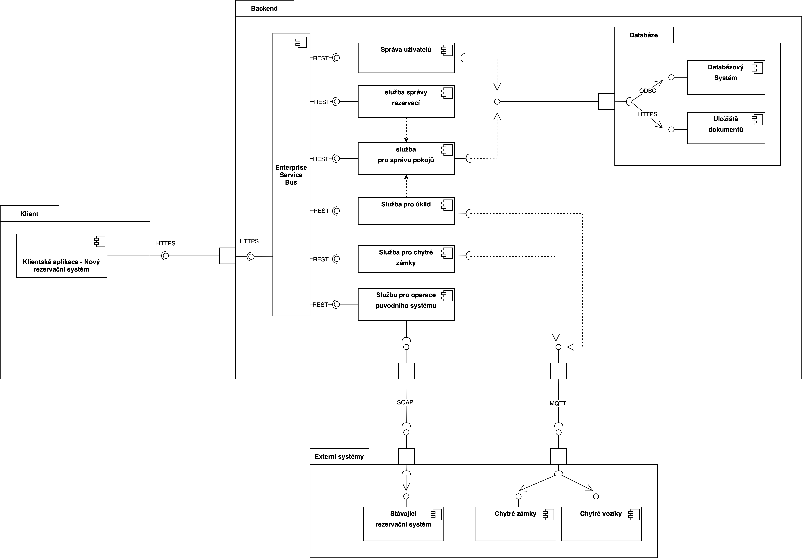

# Component View

V tomto pohledu jsou zobrazeny komponenty rezervačního systému hotelu dle architektury SOA (Service orieanted architecture).

## UML Diagram komponent

## Katalog komponent

diagram komponent pro Service Oriented Architecture (SOA) obsahuje několik klíčových komponent.

### Klient

Představuje klientskou aplikaci, která komunikuje s backendem. Tato komunikace probíhá přes HTTPS – standardní protokol pro zabezpečenou komunikaci.

### Backend

Tvoří jádro systému, kde jsou hostovány všechny serverové komponenty a služby.

### Enterprise Service Bus

Slouží jako hlavní komunikační kanál mezi různými službami, které integruje. Umožňuje komunikaci pomocí REST API.

### Služby

- **Správa uživatelů** - Tato služba je zodpovědná za správu uživatelských účtů a profilů.

- **Služba správy rezervací** - Služba pro řízení rezervací – vytváření, aktualizace a storno rezervací.

- **Služba pro správu pokojů** - Spravuje a aktualizuje informace o pokojích (dostupnost, cena, stav) a umožňuje prohlížení pokojů.

- **Služba pro úklid: Koordinuje úklidové operace** – především plánování a prioritizaci úklidu.

- **Služba pro chytré zámky** - Integrace systému s chytrými zámky pokojů pro zajištění a kontrolu přístupu.

- **Služba pro operace původního systému** - Slouží jako most k existujícímu rezervačnímu systému a zahrnuje metody jako je platba, informace o registraci apod.

### Databáze

Skládá se z databázového systému a úložiště dokumentů. Dochází zde k oddělení strukturovaných a nestrukturovaných dat. Komunikace s backendovými službami probíhá přes JDBC.

### Externí systémy

Stávající rezervační systém je integrován s novým systémem. Stávající rezervační systém komunikuje pomocí protokolu SOAP.

**Chytré zámky a Chytré vozíky** - Komunikují s backendem přes MQTT – protokol pro zařízení IoT.
