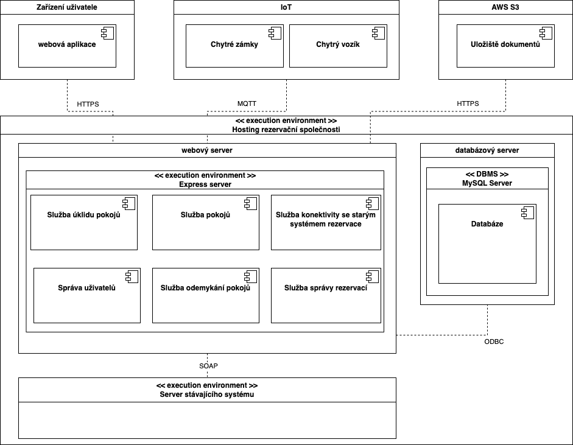

# [<-](./../README.md "Zpět") Deplyment View

V tomto pohledu je zobrazena infrastruktura rezervačního systému hotelu dle architektury SOA (Service oriented architecture).

## UML Diagram nasazení

## Katalog komponent

### Zařízení uživatele

- **webová aplikace**: Aplikace dostupná uživatelům pro interakci s hotelovým systémem.

### IoT

- **Chytré zámky:** Elektronické zámky na dveřích pokojů, které jsou součástí systému.
- **Chytrý vozík:** Robotické vozíky používané v hotelu pro různé účely.

### AWS S3

- **Uložiště dokumentů**: Cloudové úložiště pro správu dokumentů hotelu.

### Hostingové prostředí

- **webový server:** Server poskytující hosting pro webové aplikace a služby.
- **Express server:** Aplikační server používající framework Express.js pro Node.js.
- **Služby webového serveru**
  - **Služba klíčů pokojů:** Služba pro správu elektronických klíčů.
  - **Služba pokojů:** Služba pro správu stavu a informací o pokojích.
  - **Služba odemykání pokojů:** Služba pro odemykání pokojů na dálku.
  - **Služba konektivity se starým systémem rezervace:** Propojení s předchozími systémy.
  - **Služba správy rezervací:** Služba pro správu rezervací pokojů.
  - **Správa uživatelů:** Služba pro správu účtů uživatelů.

### Databázové prostředí

- **MySQL Server:** Databázový systém pro správu a ukládání dat
- **Databáze:** Hlavní úložiště dat pro systém
- **ODBC:** Interface pro připojení k databázi
